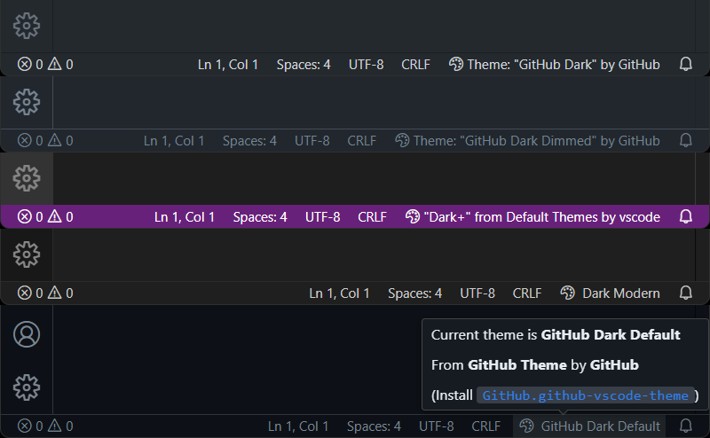

# Theme in Status Bar - VS Code Extension

This extension for Visual Studio Code allows you to display your current theme in the windows status bar.

You can freely customize the display template to your liking. From revealing only the themes name in short, up to exposing the name of the extension it is from and its author.

## Why? Who is this for?

Maybe you just want to remind yourself of what theme you are using?

Or you frequently create screenshots for blog posts, record instructional video content or stream your coding sessions to a massive audience. Surely, they often ask what theme you are using. With this extensions, they can see it right there on the edge of the screen, and you don't have to answer that same question over and over again.

## What else can it do?

Hovering the item in the status bar, displays a tooltip with more information about the theme, which might be hidden with your configured template.

Clicking it, quickly opens the theme switcher. (This can be configured to show the extension on the marketplace instead)

## Configuration

Toggle visibility by clicking the status bar with your right mouse button and selecting "Current Color Theme".

To configure the display template, open your VS Code Settings and look for the section "Theme in Status Bar". There you can set the template string, as well as find explanations about the available placeholders. Also multiple convenient example templates are provided for you to try out.

Furthermore you can choose what happens when the status bar item is clicked. Per default it will open the theme switcher. Streamers might want to change this to open the extension on the marketplace instead.

## Shortcomings

Given the fact that you can override every single color in the VS Code `settings.json` without switching the configured theme, you might create a very different color scheme than the configured theme would be. That cannot be accounted for in this extension.

## Development

For Development, use `npm install` to install dependencies and then Debug "Run Extension" in VS Code (`F5`).

(reload the VS Code window (`Ctrl+R` or `Cmd+R` on Mac) to load latest changes while running)
